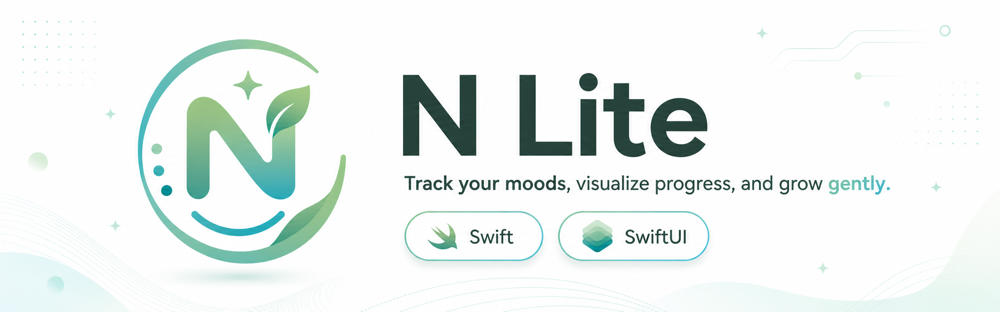
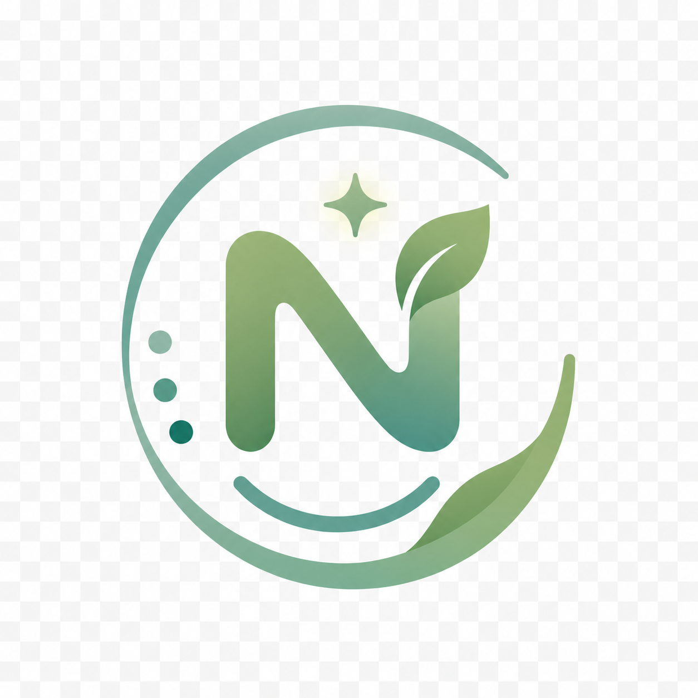

<p align="center">
  
</p>

<h1 align="center">N Lite</h1>
<p align="center">A focused iOS companion for daily mood tracking and progress reflection.</p>

<p align="center">
  
  
  
  
</p>

## Overview
N Lite is a SwiftUI-based iOS application designed to make emotional self-tracking simple, fast, and consistent. The app helps users log moods, attach short notes, and review trends through visual summaries that support long-term habit building.

## Product Goals
- Reduce friction for daily mood check-ins.
- Present progress in a clear, non-intrusive way.
- Keep architecture modular, testable, and easy to evolve.
- Maintain a clean visual identity aligned with wellness-focused UX.

## Core Features
- Home dashboard with context-aware greeting and rotating motivational quote.
- Mood Logger with emoji mood selection and optional notes.
- Recent entries list with delete actions.
- Progress analytics including distribution, weekly overview, and streaks.
- Settings for reminders, local preferences, and data management controls.
- Branded animated splash screen shown at app launch.

## Architecture
N Lite follows a feature-first MVVM structure built with SwiftUI and SwiftData.

### Architectural Style
- `Presentation`: SwiftUI views and reusable UI components.
- `State & Logic`: `@Observable` ViewModels per feature.
- `Persistence`: SwiftData `@Model` entities and `ModelContext` operations.
- `Navigation`: `TabView` root with isolated `NavigationStack` per tab.

### Data Flow
1. User interacts with a feature view.
2. View delegates intent to a feature ViewModel.
3. ViewModel validates/transforms data and writes/reads through SwiftData.
4. SwiftUI automatically re-renders from updated state/query results.

### Project Structure
```text
N Lite/
├── App/
│   ├── N_LiteApp.swift
│   └── ContentView.swift
├── Models/
│   └── MoodModel.swift
├── Features/
│   ├── Home/
│   │   ├── ViewModels/
│   │   └── Views/
│   ├── MoodLogger/
│   │   ├── ViewModels/
│   │   └── Views/
│   ├── Progress/
│   │   ├── ViewModels/
│   │   └── Views/
│   └── Settings/
│       ├── ViewModels/
│       └── Views/
├── Assets.xcassets/
├── Core/
├── Services/
└── docs/
    └── images/
```

## Technology Stack
- Swift 5
- SwiftUI
- SwiftData
- Observation (`@Observable`, `@Bindable`)
- Xcode project configuration with iOS deployment target `26.0`

## Persistence Model
`MoodModel` is the primary persisted entity and contains:
- mood value (emoji-based category)
- creation date
- optional free-form note content

This model powers both the log history and analytics surfaces.

## Getting Started
### Requirements
- macOS with a full Xcode installation
- Xcode 26.0 or newer
- iOS 26.0 SDK or newer

### Run Locally
1. Clone the repository.
2. Open `N Lite.xcodeproj` in Xcode.
3. Select an iOS simulator or connected device.
4. Build and run.

## Quality and Maintainability Notes
- Feature boundaries are explicit and easy to extend.
- Reusable components reduce visual duplication.
- ViewModel responsibilities are separated from view rendering.
- Persistence operations are centralized in feature logic.

## Roadmap Direction
- Improved export/import workflows.
- Optional cloud sync strategy.
- Extended insights and trend modeling.
- Enhanced test coverage for analytics and persistence flows.

## Author
Dimitrije Milenkovic

<p align="center">
  
</p>
<p align="center"><strong>Built to support consistent reflection, one day at a time.</strong></p>
